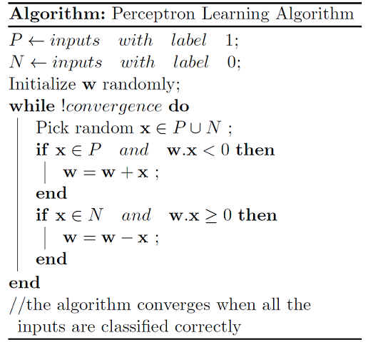

<!--

- Machine Learning
- Statistics , Math
- Data Engineering
- Programming
- EDA & Visualization
- Data Extraction & Wrangling

**Perceptron은 딥러닝의 기초가 되는 알고리즘이다. 개념은 간단하지만 추후 나올 다른 신경망의 기원이 되는 알고리즘인 만큼 정확히 알 필요가 있다. 여기서는 최적화 관점에서의 Perceptron을 다룬다.**


#참고

https://cinema4dr12.tistory.com/1016?category=515283

https://www.kdnuggets.com/2021/07/top-python-data-science-interview-questions.html
-->

**Perceptron은 딥러닝의 기초가 되는 중요한 알고리즘이지만 Percepton 자체는 그냥 인풋을 두 개의 클래스로 분류하는 이진분류에 속한다.
최적화 관점에서의 Perceptron을 알아보자**

- [Perceptron](#perceptron)
  - [최적화 관점에서의 Perceptron](#최적화-관점에서의-perceptron)
  - [Perception as Linear Binary Classifier](#perception-as-linear-binary-classifier)
- [논리게이트](#논리게이트)
- [활성화 함수](#활성화-함수)
  - [Step Function](#step-function)
  - [Sigmoid Function](#sigmoid-function)
  - [RelU Function](#relu-function)
- [Python으로 Perceptron 구현하기](#python으로-perceptron-구현하기)
- [정리](#정리)
- [References](#references)

---

## Perceptron

Perceptron은 **여러 신호를 입력으로 받아 하나의 신호를 출력하는 일종의 뉴런**이다. 생물학에서 이야기하는 그 뉴런의 컨셉을 생각하면 이해가 쉽다.


- 한개의 뉴런으로 여러 입력신호(x0, x1, ...)가 입력되면 각각 고유한 가중치(weights, w0, w1, ...)가 곱해지고 더해진다.
- 편향(bias)
- 가중치가 곱해진 값들은 모두 더해져 정해진 임계값(threshold)을 넘을 경우에만 다음 노드들이 있는 층(layer)으로 신호가 전해진다.


아래 그림을 통해 기본적인 퍼셉트론 노드의 구조를 쉽게 이해할 수있다.


<center><b>그림1. Perceptron 구조</b></center>


**Perceptron은 정확히 말하면 Perceptron Learning Algorithm인데 이름에서 보다시피 알고리즘의 일종이다.**


기본적으로 SVM이나 Decision tree 처럼 학습을 하는 알고리즘이기 때문에 최적화 문제랑 같이보면 이해가 쉽다.


1. 가중치(w) 를 
2. 가중치를 업데이트한다.
   
   가중치


\begin{align}
 y =activation(\sum(w_{1}x_{1} + w_{2}x_{2} + ... + w_{n}x_{n}) + bias)
\end{align}



<center><b>그림2. Perceptron Learning Algorithm</b></center>


### 최적화 관점에서의 Perceptron

최적화 관점으로 생각하면 Perceptron 또한 비용함수인 $f(h)-y$ 를 최소화 하는 목적을 가지고 있다고 볼 수 있다.


Perceptron 알고리즘에서의 비욯함수는 `0-1 loss`인데 이는 단순히 잘못된 예측에 대해 1의 패널티를 부여하고 제대로된 예측은 그대로 놔두는 것이다.

이를 수식으로 나타내면 아래와 같다

$$
L(\hat{y}, y) = I(\hat{y} \ne y)
$$

(여기서 I 는 indicator 함수로 0아니면 1의 결과를 반환한다.)

이러한 비용함수의 문제는 gradient descent 를 사용해 국소최적해(local optimum) 를 찾기 어렵다는 것이다.


### Perception as Linear Binary Classifier
Perceptron의 컨셉을 다시 살펴보면 


## 논리게이트


## 활성화 함수

활성화 함수는 입력벡터와 가중치벡터의 가중합인 net input을 받아 출력신호를 도출해내는 함수이다.

### Step Function

### Sigmoid Function

### RelU Function


## Python으로 Perceptron 구현하기

간단한 Perceptron을 Python으로 구현해보자

```


```

## 정리

- 퍼셉트론은 입출력을 가지는 일종의 알고리즘이다. 입력에 따라 정해진 규칙에 따른 값을 반환한다.

- 퍼셉트론은 가중치와 편향을 매개변수로 지정한다.
  - 가중치
  - 편향
  
- 퍼셉트론으로 논리회로를 표현할 수 있다.

- XOR 게이트의 경우 단층 퍼셉트론을 사

- 퍼셉트론은 샘플을 입력받아 가중치 w를 연결하여 net input을 계산한다. 

- net input은 입력벡터와 가중치 벡터의 내적이다. 

- net input은 activation 함수로 전달되어

  
## References

- https://en.wikipedia.org/wiki/Perceptron
- https://towardsdatascience.com/perceptron-learning-algorithm-d5db0deab975