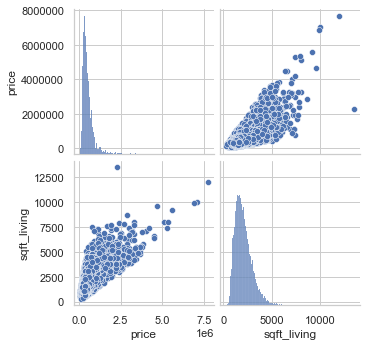
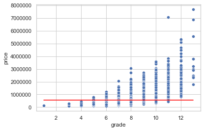

## Intro
- Python 선형회귀 연습하기
- nbconvert를 활용해 ipynb파일을 마크다운 파일로 변환

## scikit-learn을 활용한 단순선형회귀

### 데이터 불러오기 및 전처리


```python
import pandas as pd
import seaborn as sns
import matplotlib.pyplot as plt
from sklearn.linear_model import LinearRegression
```

```python
df = pd.read_csv('../data/kc_house_data.csv')
df.head()
```


<div>
<style scoped>
    .dataframe tbody tr th:only-of-type {
        vertical-align: middle;
    }

    .dataframe tbody tr th {
        vertical-align: top;
    }

    .dataframe thead th {
        text-align: right;
    }
</style>
<table border="1" class="dataframe">
  <thead>
    <tr style="text-align: right;">
      <th></th>
      <th>id</th>
      <th>date</th>
      <th>price</th>
      <th>bedrooms</th>
      <th>bathrooms</th>
      <th>sqft_living</th>
      <th>sqft_lot</th>
      <th>floors</th>
      <th>waterfront</th>
      <th>view</th>
      <th>...</th>
      <th>grade</th>
      <th>sqft_above</th>
      <th>sqft_basement</th>
      <th>yr_built</th>
      <th>yr_renovated</th>
      <th>zipcode</th>
      <th>lat</th>
      <th>long</th>
      <th>sqft_living15</th>
      <th>sqft_lot15</th>
    </tr>
  </thead>
  <tbody>
    <tr>
      <th>0</th>
      <td>7129300520</td>
      <td>20141013T000000</td>
      <td>221900.0</td>
      <td>3</td>
      <td>1.00</td>
      <td>1180</td>
      <td>5650</td>
      <td>1.0</td>
      <td>0</td>
      <td>0</td>
      <td>...</td>
      <td>7</td>
      <td>1180.0</td>
      <td>0</td>
      <td>1955</td>
      <td>0</td>
      <td>98178</td>
      <td>47.5112</td>
      <td>-122.257</td>
      <td>1340</td>
      <td>5650</td>
    </tr>
    <tr>
      <th>1</th>
      <td>6414100192</td>
      <td>20141209T000000</td>
      <td>538000.0</td>
      <td>3</td>
      <td>2.25</td>
      <td>2570</td>
      <td>7242</td>
      <td>2.0</td>
      <td>0</td>
      <td>0</td>
      <td>...</td>
      <td>7</td>
      <td>2170.0</td>
      <td>400</td>
      <td>1951</td>
      <td>1991</td>
      <td>98125</td>
      <td>47.7210</td>
      <td>-122.319</td>
      <td>1690</td>
      <td>7639</td>
    </tr>
    <tr>
      <th>2</th>
      <td>5631500400</td>
      <td>20150225T000000</td>
      <td>180000.0</td>
      <td>2</td>
      <td>1.00</td>
      <td>770</td>
      <td>10000</td>
      <td>1.0</td>
      <td>0</td>
      <td>0</td>
      <td>...</td>
      <td>6</td>
      <td>770.0</td>
      <td>0</td>
      <td>1933</td>
      <td>0</td>
      <td>98028</td>
      <td>47.7379</td>
      <td>-122.233</td>
      <td>2720</td>
      <td>8062</td>
    </tr>
    <tr>
      <th>3</th>
      <td>2487200875</td>
      <td>20141209T000000</td>
      <td>604000.0</td>
      <td>4</td>
      <td>3.00</td>
      <td>1960</td>
      <td>5000</td>
      <td>1.0</td>
      <td>0</td>
      <td>0</td>
      <td>...</td>
      <td>7</td>
      <td>1050.0</td>
      <td>910</td>
      <td>1965</td>
      <td>0</td>
      <td>98136</td>
      <td>47.5208</td>
      <td>-122.393</td>
      <td>1360</td>
      <td>5000</td>
    </tr>
    <tr>
      <th>4</th>
      <td>1954400510</td>
      <td>20150218T000000</td>
      <td>510000.0</td>
      <td>3</td>
      <td>2.00</td>
      <td>1680</td>
      <td>8080</td>
      <td>1.0</td>
      <td>0</td>
      <td>0</td>
      <td>...</td>
      <td>8</td>
      <td>1680.0</td>
      <td>0</td>
      <td>1987</td>
      <td>0</td>
      <td>98074</td>
      <td>47.6168</td>
      <td>-122.045</td>
      <td>1800</td>
      <td>7503</td>
    </tr>
  </tbody>
</table>
<p>5 rows × 21 columns</p>
</div>


```python
# * 가 파이썬에서 뭘 의미하는지 찾아보자
# https://mingrammer.com/understanding-the-asterisk-of-python/
# https://treyhunner.com/2018/10/asterisks-in-python-what-they-are-and-how-to-use-them/
use_col = df.columns.tolist()[3:]
print(*use_col, sep = '\n')
```

    bedrooms
    bathrooms
    sqft_living
    sqft_lot
    floors
    waterfront
    view
    condition
    grade
    sqft_above
    sqft_basement
    yr_built
    yr_renovated
    zipcode
    lat
    long
    sqft_living15
    sqft_lot15
    


```python
# 상관행렬 구하기
corrMatrix = df.corr()
# 상관행렬에서 타겟변수 추출
price_col = corrMatrix['price'].to_frame().reset_index()
# 상관계수높은 순으로 정렬
price_col.sort_values('price',ascending=False,inplace=True)
price_col.head()
```


<div>
<style scoped>
    .dataframe tbody tr th:only-of-type {
        vertical-align: middle;
    }

    .dataframe tbody tr th {
        vertical-align: top;
    }

    .dataframe thead th {
        text-align: right;
    }
</style>
<table border="1" class="dataframe">
  <thead>
    <tr style="text-align: right;">
      <th></th>
      <th>index</th>
      <th>price</th>
    </tr>
  </thead>
  <tbody>
    <tr>
      <th>1</th>
      <td>price</td>
      <td>1.000000</td>
    </tr>
    <tr>
      <th>4</th>
      <td>sqft_living</td>
      <td>0.702035</td>
    </tr>
    <tr>
      <th>10</th>
      <td>grade</td>
      <td>0.667434</td>
    </tr>
    <tr>
      <th>11</th>
      <td>sqft_above</td>
      <td>0.605567</td>
    </tr>
    <tr>
      <th>18</th>
      <td>sqft_living15</td>
      <td>0.585379</td>
    </tr>
  </tbody>
</table>
</div>


```python
# 가장 상관관계가 높은 변수 시각화
sns.set(style='whitegrid', context='notebook')
g=sns.pairplot(df[['price','sqft_living']])
for ax in g.axes.flatten(): # y축 한정 과학적 표기법을 일반 표기법으로 바꿔주기
    ax.ticklabel_format(style='plain', scilimits=(0,0), axis='y')
#plt.ticklabel_format(style='plain', axis='y')
plt.show()
```


    

    


### Baseline Model 만들기


```python
# get baseline model
baseline = df['price'].mean()
errors = df['price'] - baseline
mae = errors.abs().mean()

sns.lineplot(x=df['grade'], y=baseline, color='red')
sns.scatterplot(data=df, x="grade", y="price")
plt.ticklabel_format(style='plain', axis='y')
```


    

    


```python

#기본적으로 모델이 다중회귀를 가정하기 때문에 Feature의 선언을 배열로 해줘야 한다.

X = df[['sqft_living']] 
y = df['price']
m = LinearRegression()
```


```python
m.fit(X,y)
```


    LinearRegression()


```python
X_test = [[6000]]
y_pred = m.predict(X_test)
print(f'sqft_living이 {X_test[0][0]}인 경우의 예상 가격은 {int(y_pred)}로 나타남')
```

    sqft_living이 6000인 경우의 예상 가격은 1640160로 나타남
    


```python
# 통계량 확인
print("coefficient-score : ",m.coef_)
print("intercept : " , m.intercept_)
print("coefficient of determination: {:.2f}".format(m.score(X,y)))
```

    coefficient-score :  [280.6235679]
    intercept :  -43580.74309447361
    coefficient of determination: 0.49
    

## References

- https://scikit-learn.org/stable/modules/linear_model.html
- https://scikit-learn.org/stable/auto_examples/linear_model/plot_ols.html#sphx-glr-auto-examples-linear-model-plot-ols-py
