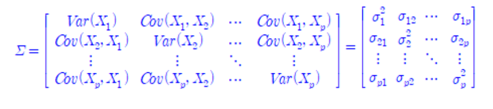

- **비지도학습은 라벨이 달린 데이터를 이용해 데이터를 학습하는 과정 없이 데이터로부터 의미를 추출하는 것이다.**
- **비지도학습의 목적은 크게 차원축소와 클러스터링 두 가지로 나눌 수 있다.**
---

- **비지도학습**
  - **차원축소(PCA)** : 데이터의 변수를 관리 가능한 수준으로 차원을 줄이는 것, 변수와 레코드의 수가 아주 큰 상황이라면 차원축소를을 EDA의 연장으로 볼 수있다. 
    - PCA
    - LDA
    - SVD
    - 요인분석
    - etc
  - **클러스터링**: 라벨이 정해진 응답변수가 없는 상황에서 예측 규칙을 만드는 것(그룹화)
    - K평균 클러스터링
    - 계층적 클러스터링
    - 모델기반 클러스터링
    - etc

## 주성분분석(PCA)

>**주성분분석은 데이터의 차원을 줄이기 위해, 공분산 행렬에서 고유 벡터/고유값을 구하고 가장 분산이 큰 방향을 가진 고유벡터에 입력데이터를 선형변환하는 것이다.**

위 말을 이해하기 위해서는 차원축소를 하는 이유와 선형대수 관련 개념을 조금 알아야 한다.

### 차원을 줄이는 이유

차원을 줄이는 이유는 크게 두 가지가 있는데 하나는 메모리 소모를 줄이기 위해서고 다른 하나는 차원의 저주 때문이다.

**메모리 소모 문제**
R을 생각해보자. R을 써본 사람은 알겠지만 정말 개같이 느린 언어이다. 이는 R이 물리적 메모리를 저장하는 방식을 사용하기 때문이다.물론 파이썬도 그렇게 빠른 언어는 아니다. 넘파이가 빠른거지 파이썬이 빠른게 아니다. 그리고 넘파이는 C랑 포트란으로 짜여졌다.
이처럼 수치해석을 하기에는 너무나도 느린 언어들로 큰 데이터를 분석하다보면 시간은 시간대로 날려먹고 제대로된 결과를 뽑지 못할 가능성이 높다. 따라서 데이터양이(정확히는 데이터 n값과 predictor의 수의 곱이) 너무 많을 경우 PCA등의 차원축소기법을 사용해 데이터의 차원을 줄여 분석에 쓰이는 연산량을 줄이는 방법을 사용한다.

**차원의 저주(curse of demention)**
데이터의 수보다 데이터의 차원이 더 큰 경우를 차원의 저주라고 하는데 이경우 모델링이 복잡해지고 예측력이 낮아진다. 이러면 모델링 자체가 쓸모없어지기에 차원이 너무 많은 경우 Feature Selection이나 Feature Extraction 등을 통해 사전 처리를 해줄 필요가 있다. 

### **공분산행렬**

공분산행렬만 이해하면 PCA는 사실 그렇게 어렵지는 않다. PCA는 단순히 공분산행렬의 고유벡터를 기저벡터로 바꾼 것에 불과하다.일단 공분산이 뭔지 알아야 한다.
공분산은 교차곱편차의 평균이다. 이는 각 변수들의 편차들의 곱들을 모두 더해 n으로 나눈 값을 의미한다.

데이터 매트릭스 X에 대해서 공분산행렬을 아래와 같이 나타낼 수 있다.(자유도때문에 n-1로 나눠줌)

$$Cov(X) = \frac{1}{n-1}X^TX$$

공분산은 **기본적으로 변수들이 함께 변화하는 정도**이다.

공분산행렬은 **대각성분을 설명변수의 분산으로 채우고 나머지를 공분산으로 채운 행렬이다.**



**그림1. 한번에 이해하는 공분산 행렬**

### 선형변환
- **행렬은 선형변환을 나타낸다.**
- 선형은 곱하고 더하는 것으로만 이루어져 있다.(문과식 이해의 한계)
- 벡터 `[a,b]` 의 와 행렬 M을 곱해 벡터 `[c,d]`가 나왔을 경우 
- `[c,d]`는 유닛 벡터 `[x,y]` 의 의 a배와 b 배의 합으로 이해할 수 있다. 
- 이처럼 선형변환은 기본적으로 행렬과 벡터의 곱의 형태로 나타낼 수잇다.
  
다시 생각해 보면 다음과 같다.

- `f` 라는 어떤 매핑을 사용하여 
- 임의의 벡터 `[a, b]`에 대해서, 
- `[2a + b, a -2b ]`로 바꾼다는 것은 아래와 같이 나타낼 수 있다.

$$\begin{align}
f(\begin{bmatrix}a \\ b \end{bmatrix}) = \begin{bmatrix} 2a + b \\ a -2b \\  \end{bmatrix}
\end{align}$$

여기서 `[2a + b, a -2b ]`는 `[c,d]` 이며 특정 유닛벡터 (여기서는 `[2+b/a, a/b-2]`) 에 각각 a배, b배 한 값이 된다.

**여기서 `f`를 행렬을 곱하는 것으로 생각하면 놀랍게도 행렬과 벡터의 곱이 벡터의 선형변환과 동일하다는 것을 알 수 있다.**

### **Eigenvalue,Eigenvector**
- 일단 행렬이 선형변환이라는 것을 알아야 한다. [진짜 설명 오지는 레퍼런스](https://angeloyeo.github.io/2019/07/15/Matrix_as_Linear_Transformation.html)를 읽어보자.
- Eigenvector 는 특정 벡터에 대해 선형변환을 했을 때 크기만 바뀌고 방향은 바뀌지 않는 벡터(축)이다.(행렬의 방향성을 유지하는 선형변환의 주축)
- Eigenvector 는 행렬이 벡터에 작용하는 주축이다.
- **Eigenvector 는 어떤 행렬이 벡터에 작용하는 힘의 방향을 나타낸다.**
  - 만약 그 행렬이 공분산 행렬일 경우 그 공분산 행렬의 고유 벡터는 데이터가 어떤 방향으로 분산되어 있는지, 즉 어떤 방향으로 힘이 작용하는 지 나타낸다.-> 공분산행렬의 Eigenvector가 원데이터의 분산이 최대가 되는 축이다.
- **Eigenvalue는 Eigenvector의 방향으로 크기가 얼마나 변화하는 지를 나타내는 값이다.**

<!--
$$ T \cdot v = v' = \lambda \cdot v $$


-->

$$A = cov(v)$$

$$Ax = \lambda x$$

- A는 행렬 v의 공분산행렬이다.
- 여기서의 $\lambda$가 Eigenvalue이다.
- x가 Eigenvector이다.

x가 0이 아니여야 식이 성립하기 때문에 행렬식을 활용해 다음을 만족하는 벡터를 찾는다.


$$(A-\lambda I)\vec{x}=0$$


$$det(A−\lambda I)=0$$


$$\begin{bmatrix} a & b \\ c & d \end{bmatrix}\begin{bmatrix} x \\ y \end{bmatrix} = \begin{bmatrix} ax+by \\ cx+dy \end{bmatrix} = \lambda \begin{bmatrix} x \\ y \end{bmatrix}
$$

### **주성분**

결국 PCA에서 하고자 하는 것은 차원을 축소하면서 데이터 벡터를 **어떤 벡터**에 내적하는 것이 가능한 정보량(분산)을 유지하는 것인지 알아내는 것이다. 차원을 축소하면서 정보손실을 적게 하려면 원데이터의 분산이 최대가 되는 축을 찾아야 한다. 여기서 축이 되는 **어떤 벡터**가 주성분이며 공분산행렬의 eigenvector이다. 

**linear combination**
주성분은 변수들의 선형 결합으로 표현된다. 이는 어떤 주성분 PC1이 있다고 했을때 이 PC1는 마치 다중회귀식마냥 기존 변수들의 조합으로 표현된다는 것이다.


**그림2. 선형결합으로서의 주성분**
### **Feature Selection & Extraction**
차원축소는 크게 변수선택과 변수추출로 나뉘며 PCA는 그 중 변수 추출에 속한다.
- **변수선택**
  - 덜 중요한 피처를 제거하는 방식으로 차원을 축소하는 방식
  - ex) `Lasso`,`Generic algorithm`
- **변수추출**
  - 기존변수를 조합해서 새 변수를 만드는 방식
  - 변수간 연관성을 고려할 수있다
  - 해석이 어렵다.


**그림3 변수선택과 변수추출의 직관적 이해**

### **정리**
- **선형변환**
  - 행렬은 선형변환이다.
  - 즉, 임의의 $\mathbb{R}^2$ 벡터를 다른 $\mathbb{R}^2$ 내부의 벡터로 변환 하는 과정은 특정 $M$라는 매트릭스를 곱하는 것과 같다.

- **공분산행렬**
  - 공분산은 교차곱편차의 평균이며 각 변수들이 얼마나 함께 변화하는 지를 나타낸다.
  - 공분산을 표준화하면 상관계수이다. 
  - 공분산행렬은 각 feature들의 변동이 얼마나 유사한지를 나타낸다.
  - 공분산행렬 자체는 단순히 정사각행렬의 대각성분을 각 변수의 분산으로 채우고 나머지를 공분산으로 채운 것이다.
  - 공분산행렬의 서로다른 eigenvector 끼리는 직교한다.따라서 해당 eigenvector를 기저벡터로 하게끔 좌표축이 바뀐 데이터는 서로 상관이 없게 된다.
- **고윳값/고유벡터**
  - 고윳값은 벡터의 크기이다
  - 고유벡터는 특정 벡터에 선형변환을 했을 때 크기만 바뀌고 뱡향은 바뀌지않는 벡터이다. 기본적으로 방향이다.
  - 공분산행렬의 고유벡터의 열벡터가 주성분이다.
  - 고유값은 기존벡터에서 고유벡터로 정사영했을 때의 분산이다.따라서 고유벡터로 사영할 경우 분산이 최대가 된다.
- **주성분분석**
  - 주성분은 수치형 예측변수의 선형결합(linear combination)이다.
  - 주성분은 공분산행렬의 eigenvector이다.
  - 주성분은 서로간의 상관관계가 최소화 되어 중복성이 줄어들도록 한다 
  - 차원의 수만큼 주성분이 존재하며 모든 차원의 주성분의 설명량은 1이다.
  - 주성분의 일부만으로도 전체 분산의 대부분을 설명할 수 있다.
  - 첫번째 주성분이 가장 큰 분산을 가지고 있고 두번째 주성분은 첫번째 주성분과 직교한다는 전제 하에 두번째로 큰 분산을 가지고 있다.
  - 부하(loading)는 예측변수들을 주성분으로 변동할때 쓰이는 가중치이다. 계수이다.
  - Screeplot은 성분들의 변동을 나타낸다. 정확히는 성분의 수에 따른 분산의 변화량을 나타낸다. 
  - 다음의 두 가지 경우 PCA의 적용이 어렵다
    - 데이터의 분포가 정규성을 띄지 않는 경우 적용 어려움
      - 이 경우 커널 PCA 사용
    - 분류 / 예측 문제에 대해서 데이터의 라벨을 고려하지 않기 때문에 효과적 분리가 어려움
      - 이 경우 PLS 사용

## 구현하기(R, Python)
> 사실 이해하는게 어렵지 다른 대부분의 분석들과 마찬가지로 구현 자체는 매우 쉽다.

### Eigenvalue, Eigenvector 구하기
- R을 활용한 Eigenvalue, Eigenvector 계산 
```r

# eigen()을 사용해 매우 쉽게 구할 수 있다

> M <- as.matrix(data.frame(c(1,-1,0),c(1,2,1),c(-2,1,-1)))
> M
     c.1...1..0. c.1..2..1. c..2..1...1.
[1,]           1          1           -2
[2,]          -1          2            1
[3,]           0          1           -1
> eigen(M)
eigen() decomposition
$values
[1]  2  1 -1

$vectors
          [,1]       [,2]          [,3]
[1,] 0.3015113 -0.8017837  7.071068e-01
[2,] 0.9045340 -0.5345225 -1.922963e-16
[3,] 0.3015113 -0.2672612  7.071068e-01


```
### 공분산행렬 구하기
- R을 활용한 Eigenvalue, Eigenvector 계산 
```r
```
- R을 활용한 Eigenvalue, Eigenvector 계산 
```python


```

### PCA구현하기

- R을 활용한 pca
```r
df <- data[,c('a','b')]
pca<-princomp(df)

pca$loadings # 주성분 부하량 확인

```

- python을 활용한 pca
```python
from sklearn.decomposition import PCA
pca = PCA(n_components=2) # n_components로 주성분의 수를 지정할 수 있다.
pca_values = pca.fit_transform(data_use) # 설명량

print('누적설명량 {0}'.format(sum(pca.explained_variance_ratio_)))
print('각 차원의 설명량 {0}'.format(pca.explained_variance_ratio_))

```

### PCA 시각화 관련 참고
- seaborn을 활용한 시각화
```python
# seaborn을 활용한 시각화

sns.scatterplot(pca_v[0],pca_v[1],data=pca_v,hue = 'target',
style = 'target',
s = 100)

```
- matplotlib을 활용한 시각화(1)
```python
import plotly.express as px
from sklearn.decomposition import PCA

df = px.data.iris()
features = ["sepal_width", "sepal_length", "petal_width", "petal_length"]

pca = PCA()
components = pca.fit_transform(df[features])
labels = {
    str(i): f"PC {i+1} ({var:.1f}%)"
    for i, var in enumerate(pca.explained_variance_ratio_ * 100)
}

fig = px.scatter_matrix(
    components,
    labels=labels,
    dimensions=range(4),
    color=df["species"]
)
fig.update_traces(diagonal_visible=False)
fig.show()
```
- matplotlib을 활용한 시각화(2)
```python
fig = plt.figure(figsize = (8,8))
ax = fig.add_subplot(1,1,1) 
ax.set_xlabel('Principal Component 1', fontsize = 15)
ax.set_ylabel('Principal Component 2', fontsize = 15)
ax.set_title('2 component PCA', fontsize = 20)
targets = ['Iris-setosa', 'Iris-versicolor', 'Iris-virginica']
colors = ['r', 'g', 'b']
for target, color in zip(targets,colors):
    indicesToKeep = finalDf['target'] == target
    ax.scatter(finalDf.loc[indicesToKeep, 'principal component 1']
               , finalDf.loc[indicesToKeep, 'principal component 2']
               , c = color
               , s = 50)
ax.legend(targets)
ax.grid()
```
## References
- 책
  - Practical Statistics for Data Science
- 블로그
  - https://wiserloner.tistory.com/1297 # 고유값과 고유벡터
  - https://huidea.tistory.com/126 #기술면접 참고
  - https://rfriend.tistory.com/380 #python 선형대수 함수
  - https://rfriend.tistory.com/181 #고유값과 고유벡터 구현
  - https://youtu.be/jNwf-JUGWgg # 공분산행렬의 이해
  - https://ratsgo.github.io/linear%20algebra/2017/03/14/operations/ # 행렬연산과 공분산행렬
  - 시각화
    - https://plotly.com/python/pca-visualization/
    - https://towardsdatascience.com/pca-using-python-scikit-learn-e653f8989e60