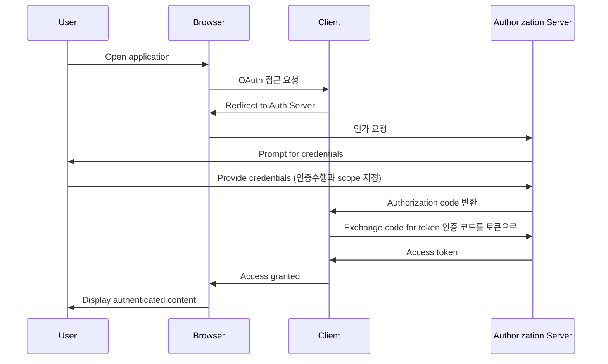

## 컨셉들

---

**_Concept_**

- **인증** : Authentication. 사용자가 누구인지 식별하는 것
- **Authorization** : 인가. 인증된 사용자가 특정 리소스에 접근할 수 있는지 결정하는 것
- **Authorization Server** : 인증을 검증하고 권한을 부여하는 주체. Resource Server에 접근할 수 있는 AccessToken을 발급
- **Resource Server** : 인증된 사용자가 접근할 수 있는 리소스를 제공. 인가를 수행하고 리소스를 제공하는 주체
- **Resource Owner** : 리소스 소유자. 인증을 수행하는 주체
- **Client** : OAuth2 에서 Client는 OAuth2를 사용하는 어플리케이션을 의미. 인가를 요청하는 주체
- **Authorization Code** : 클라이언트가 인증을 요청하고 인증 서버가 응답하는 코드
- **Access Token** : 클라이언트가 리소스 서버에 접근하기 위한 토큰
- **Scope** : AccessToken이 접근할 수 있는 리소스의 범위
- **OAuth** : Open Authorization. 인증을 위한 오픈 스탠다드 프로토콜
- **Provider** : Resource Server와 Authorization Server를 통합해서 Provider라고 한다.

---

## OAuth2 절차

accessToken은 나의 서비스에 필요한 다른 서비스에 접근하기 위한 권한을 부여받는다.

resoure server -> location: /oauth/authorize

## OAuth2

인증은 유저가 직접하고 인가는 클라이언트가 받는다.

Oauth2의 기본적인 아이디어는 인증과 인가의 대상을 분리하는 것이다.

### 1. 등록하기

- Client id
- Client secret
- Authorized redirect URIs : 사용자가 인증 후 리다이렉트 될 URI ex) https://localhost:8080/oauth2/callback

### 2. 인증하기

## Auth2

서비스 서버에서 토큰 발급

인가 서버의 역할:

사용자 인증
클라이언트 애플리케이션 검증
액세스 토큰 생성 및 발급
필요한 경우 리프레시 토큰 발급

액세스 토큰 생성 과정:
a. 클라이언트 서비스가 인가 서버에 토큰 요청
b. 인가 서버가 요청을 검증 (예: 인가 코드, 클라이언트 자격증명 확인)
c. 검증 성공 시 인가 서버가 액세스 토큰 생성
d. 생성된 액세스 토큰을 클라이언트에게 반환
리소스 서버의 역할:

액세스 토큰을 생성하지 않음
인가 서버가 발급한 액세스 토큰의 유효성을 검증
유효한 토큰에 대해 요청된 리소스 제공

클라이언트의 역할:

인가 서버로부터 액세스 토큰 요청 및 수신
리소스 서버에 액세스 토큰 제시하여 보호된 리소스 접근

액세스 토큰의 특징:

일반적으로 짧은 수명 (보안상의 이유)
특정 범위(scope)의 접근 권한 포함
JWT(JSON Web Token) 형식으로 자주 사용됨

보안 고려사항:

토큰은 안전한 방식으로 전송 및 저장되어야 함
HTTPS 사용 필수
토큰 탈취 위험 최소화를 위한 짧은 유효기간 설정

## Mermaid

## Reference

- Spring 기반 OAuth2.1 서버 개발
https://tech.kakaopay.com/post/spring-oauth2-authorization-server-practice/

- 생활코딩 Auth2

- [ ] #status/pending fastapi 소셜 로그인 https://github.com/bakdongho/fastapi-social-login
