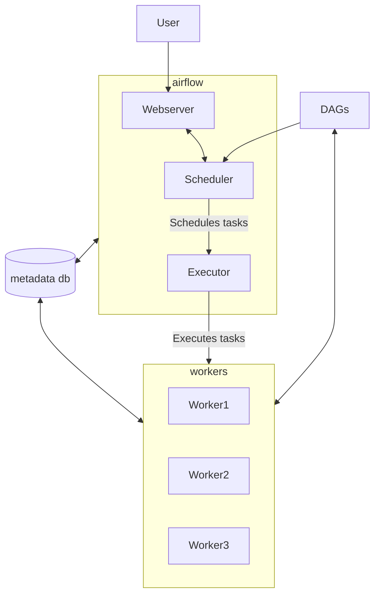

---
aliases:
  - airflow_basic cli
draft: true
tags:
  - airflow
status:
  - in_progress
created: '2024-02-03T18:52'
updated: '2024-06-04T16:19'
---
# Background

homemade orchestration system to monitor & maintain 100+ cron jobs

Engineering jobs

- Extract
- Load
- Transform

## Challenges

- Monitoring : job status
- Manage Failures : alert on failure, retries, timeouts
- Dependencies : check upstream data, run job1 before job2
- Backfills : rerun historic data ingestions
- Scalability : no centralized entity to manage jobs
- Deployment : version control orchestration system

## Terminologies

공식문서 참조

### Operators

### Tasks

### DAG

# Core Components

## Webserver

: DAGs, Tasks, 변수, Connection, pools User 관리를 위한 사용자 인터페이스

## Scheduler

:

- 기본적인 역할은 Dag Run과 Task들을 스케줄링하고 Excutor에 전달한다.
- 작업 모니터링
- Task 실행 순서 관리
-

## Worker

: Runs Actual tasks

## Executor

: Handles running tasks

## Metadata Database

Stores metadata about DAGs, tasks states

- Dag의 정보를 담고있다

## Dags Directory

directory containing DAG codes

# Overall Archiecture

# Architecture

# Executer

## Executer concept

Executor는

### Sequential Executer

### Local Executer

![[local_executor.png]]

# Core Concepts

# Scheduling

execution_date

## GUI

### dags

- runs is an instance of your dag runnning at a given time
- schedule : schedule interval

