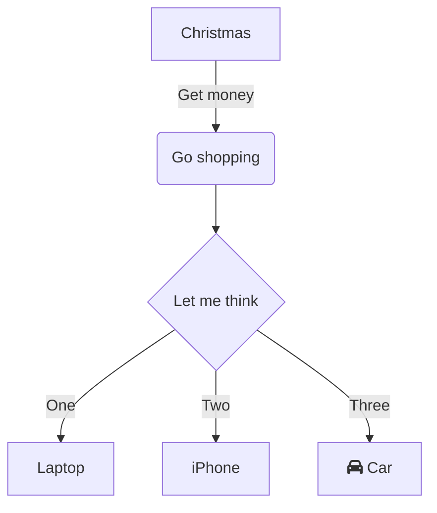

### 한글 테스트

안녕하세요 이것저것 하고있습니다

### 코드 입력 테스트

```python

```

### 머신러닝 관점에서의 회귀

회귀분석에서 MSE은 비용함수이다. 
비용함수를 최소화 하는 최적화 관점에서 머신러닝을 볼 수 있다.
기울기 업데이트를 통해 비용함수(MSE)의 최소값을 찾는다.

---

***Concept***

- **Gradient Descent** : 함수의 기울기(즉, gradient)를 이용해 x의 값을 어디로 옮겼을 때 함수가 최소값을 찾는지 알아보는 방법. 함수값을 최소화 하는 독립변수를 찾는 방법
- **learning rate** : 학습을 한 내용을 다음 학습에 얼마나 반영할지의 문제. 정확히는 Loss 값을 각각의 가중치로 편미분하여 얻어낸 값에 얼마나 수정을 해야 할 지를 결정하는 하이퍼파라미터
  - learning rate가 너무 크다면 최적점에 도달하지 못하고 모델이 발산할 수 있다.
  - learning rate가 너무 작다면 최적점에 도달하지 못하고 학습이 끝날 수 있다.
- **iteration** : 학습(가중치 업데이트)의 반복횟수
- **weight** : 경사하강법을 통해 업데이트 되는 feature의 가중치
- **bias** : 활성함수에서 활성화가 잘 될지 안될지를 조절하는 hypterparameter의 일종.기본적으로 function curve 자체를 조정한다.(선형 비선형 상관없이)

---

#### Cost function of Linear Regression

- 이는 가설함수-실제 target 인 오차 제곱합에 대해 평균을 취한 것이다.
- 비용을 최소화 하는 w와 b를 찾는 것이 머신러닝에서의 학습의 목적이 된다.
- 이를 아래와 같이 일반화 할 수 있다.
- $\omega$ 입력
- $\epsilon$

$$
cost(w, b) = \frac{1}{n} \sum_{i=1}^{n} \left[y^{(i)} - H(x^{(i)})\right]^2
$$

- 단순선형회귀의 경우 아래와 같다

$$
f(m,b) = \frac{1}{N} \sum_{i=1}^{n} (y_i - (mx_i + b))^2
$$

#### Gradiant Descent

- 경사하강법은 비용함수를 최소화하는 최적화 알고리즘의 일종이다.
- 오차가 낮아지는 방향으로 이동할 목적으로 현재 위치를 미분한다.
- **경사하강법의 원리는 반복적인 미분을 통한 w값의 업데이트를 통해 w, cost 지점의 경사(기울기)가 0이 되도록 만드는 것이다.**

**경사하강법의 원리** 

일단 비용함수인 MSE부터 시작한다.

$$
f(m,b) = \frac{1}{N} \sum_{i=1}^{n} (y_i - (mx_i + b))^2
$$

미분할 경우 아래와 같이 변하며

$$
(y_i - (mx_i + b))^2 = A(B(m,b))
$$

$$
A(x) = x^2
$$

$$
\frac{df}{dx} = A'(x) = 2x
$$

따라서 다음와 같이 미분할 수 있다.

$$
B(m,b) = y_i - (mx_i + b) = y_i - mx_i - b \~\ 
$$

$$
\frac{dx}{dm} = B'(m) = 0 - x_i - 0 = -x_i \~\ 
$$

$$
\frac{dx}{db} = B'(b) = 0 - 0 - 1 = -1 
$$

미분의 `Chain Rule` 을 활용하여 가중치와 편향의 미분값을 구할 수 있다.

$$
\frac{df}{db} = \frac{df}{dx} \frac{dx}{db}
$$

가중치와 절편에 Chain Rule을 적용해 미분을 하면 다음과 같다.

$$
\frac{df}{dm} = A'(B(m,f)) B'(m) = 2(y_i - (mx_i + b)) \cdot -x_i \\~\\
$$

$$
\frac{df}{db} = A'(B(m,f)) B'(b) = 2(y_i - (mx_i + b)) \cdot -1
$$

따라서 비용함수(MSE)의 Gradiant를 아래과 같이 유도할 수 있다.

$$
\begin{align}
  f'(m,b) =
    \begin{bmatrix}
      \frac{df}{dm}\\
      \frac{df}{db}\\
    \end{bmatrix}
  &=
    \begin{bmatrix}
      \frac{1}{N} \sum -x_i \cdot 2(y_i - (mx_i + b)) \\
      \frac{1}{N} \sum -1 \cdot 2(y_i - (mx_i + b)) \\
    \end{bmatrix}\\
  &=
    \begin{bmatrix}
       \frac{1}{N} \sum -2x_i(y_i - (mx_i + b)) \\
       \frac{1}{N} \sum -2(y_i - (mx_i + b)) \\
    \end{bmatrix}
  \end{align}
$$

**최적의 비용함수는 Learning Rate(학습률)와 기울기(Gradient)를 곱한 값을 기존 가중치에서 빼서 새로운 가중치로 설정하는 것을 반복하는 방식으로 구한다.**

**따라서 최적화하고자 하는 함수 f(x)에 대해 아래와 같이 정리할 수 있다.**

$$x_{i+1} = x_i - \alpha \frac{df}{dx}(x_i)$$

**기본적으로 반복횟수가 많아질수록 오차가 줄어들어야 한다.**


#### Gradiant Descent를 활용한 선형회귀 구현

- dw는 비용함수인 MSE를 가중치 W에 대하여 편미분한 것이다.
- db는 비용함수인 MSE를 편향 b에 대하여 편미분한 것이다.

```python
import numpy as np


def r2_score(y_true, y_pred):
    corr_matrix = np.corrcoef(y_true, y_pred)
    corr = corr_matrix[0, 1]
    return corr ** 2


class LinearRegression:

  def __init__(self, lr = 0.001, n_iters = 1000):
    self.lr = lr
    self.n_iters = n_iters
    self.weigts = None
    self.bias = None


  def fit(self,X,y):

    # init paremeters : 시작지점을 초기화 한다.
    n_samples , n_features = X.shape
    self.weigts = np.zeros(n_features)
    self.bias = 0

    for _ in range(self.n_iters):
      y_pred = np.dot(X,self.weigts) + self.bias

      dw = (1/n_samples) * np.dot(X.T,(y_pred - y)) # 가중치의 기울기(Gradiant)(미분값)
      db = (1/n_samples) * np.sum(y_pred - y) # 편향의 기울기

      self.weigts -= self.lr * dw # 기울기 업데이트
      self.bias -= self.lr * db # 편향 업데이트


  def predict(self,X):
    y_pred = np.dot(X,self.weigts) + self.bias

    return y_pred
```

## References

- [경사하강법과 회귀](https://angeloyeo.github.io/2020/08/24/linear_regression.html)
- [ML from scratch](https://youtu.be/4swNt7PiamQ?list=PLqnslRFeH2Upcrywf-u2etjdxxkL8nl7E)

### Mermaid-test


