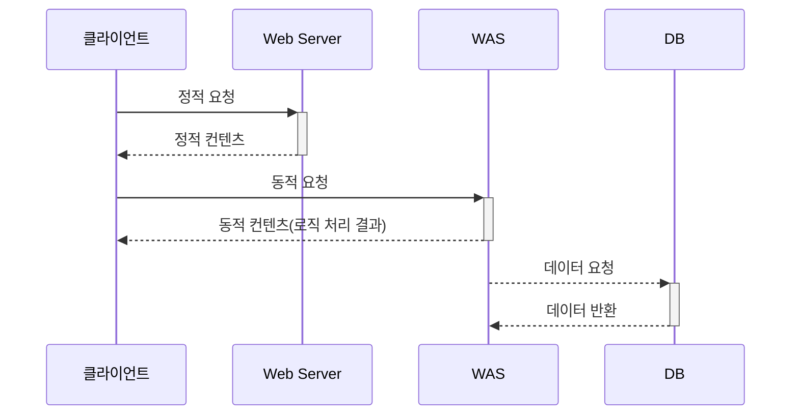

---
title: '[Spring]기본 인덱스'
categories:
  - [backend,Spring]
tags:
    - Spring
date:
updated:
---

# 스프링


## 스프링 SOLID 적용


# Java Web

### Static Content

> #concept **Static Content** :  서버에서 가공되지 않고 그대로 클라이언트에 전달되는 컨텐츠

```html
<!DOCTYPE html>
<html lang="en">
<head>
    <meta http-equiv="Content-Type" content="text/html; charset=UTF-8"/>
    <title>static content</title>
</head>
<body>
this is a static content. test
</body>
</html>
```

### Dynamic Content

> Dynamic Content는 서버에서 가공되어 클라이언트에 전달되는 컨텐츠를 말한다.


```java
@Controller
public class HelloController {
    @GetMapping("hello")
    public String hello(Model model) {
        model.addAttribute("data", "hello!!");
        return "hello";
    }
}
```

### MVC 개론

Model : 어플리케이션 데이터, 로직 처리

View : 모델에 담긴 데이터 출력

Controller : Model과 

### 템플릿 엔진

> 서버에서 데이터를 가공해서 HTML로 변환해주는 역할을 한다.

- 기본적으로 웹 컨텐츠 정보를 처리하기 위해 설계된 소프트웨어이다
- 양식에 맞추기만 하면 간단한 표현을 통해 데이터를 쉽게 가공하여 웹페이지를 생성해준다.
- 보통은 Thymeleaf 를 쓰거나 클라이언트에서 html을 만드는 방식을 쓴다.

![[spring-template-engine.png]]

#### Thymeleaf

```yaml
spring:
    thymeleaf:
        enabled: true
        cache: false  
        prefix: classpath:/templates/ # 기본 뷰 경로
        suffix: .html # 기본 뷰 확장자
```


### Web Server

> 기본적으로 정적 컨텐츠를 HTTP 프로토콜(Request, Response)을 통해 클라이언트 에게 제공해주는 서버이다.

**역할**

- 정적 컨텐츠 제공
- 동적 요청이 들어왔을 경우 컨테이너로 전달
- WAS와 연결되어 동적 컨텐츠 제공


### WAS(Web Application Server)
> 웹서버로부터 오는 동적인 요청을 처리하는 서버.  HTTP를 통해 클라이언트 장치에 어플리케이션을 수행해주는 일종의 미들웨어(소프트웨어 엔진)


- 동적(Dynamic)이란 어플리케이션 서버가 HTTP서버를 통해 브라우저에게 응답을 전송하기 전에 서버에서 어떤 동작이 이뤄져야 함을 의미한다.
- WAS 자체는 WEB Server + WEB Container의 역할을 수행한다. 
	- 의미있는 비즈니스로직을 제외한 나머지 작업
- 보통 Tomcat을 WAS로 쓴다



<p style="text-align: center;">WEB SERVER 요청 처리</p>


#### Container
> 기본적으로 동적 컨텐츠 생성을 위한 환경을 제공하는 소프트웨어

- 보통 CGI(Common Gateway Interface)를 통해 동적 컨텐츠를 생성한다.
- 자바의 경우 Servlet을 통해 동적 컨텐츠를 생성한다.

#### Context Path
> WAS에서 웹상의 어플리케이션이 어디에 있는지 구분하기 위한 PATH


- Context Path : 프로젝트 명을 의미하며 url의 호스트, 포트명 다음에 나온다.
- Context root : Content directory의 실제경로


**스프링부트에서 yaml파일로 Contextpath설정**


```yaml
server
	servlet
		context-path=/newpath

```


### Web Container
> Servlet Container와 동일한 개념이며 동적인 컨텐츠를 반환하기 위해 Servlet을 관리하는 역할을 한다.

**역할**

- 서블릿을 생성하고 소멸 및 관리하는 역할 수행(서블릿 생명주기 관리)
- 요청을 받으면 스레드를 생성하여 해당 스레드에 Request, Response 객체를 할당(URL과 servlet mapping을 통해 해당 서블릿을 찾아서 실행)
- 멀티스레드 지원
- 선언적 보안관리
- 웹서버와의 통신


#### CGI(Common Gateway Interface)

> 기본적으로 웹서버와 외부 프로그램을 연결해주는 인터페이스이다.

- CGI 자체는 웹 서버와 외부 프로그램 사이에서 정보를 주고받는 방법의 표준을 의미한다.
- Python, PHP 등의 언어에서 CGI를 지원한다.
- 자바는 CGI가 지원되지 않기 때문에 Servlet이라는 기술을 통해 CGI를 대체한다.


#### Web Container 작동방식

1. 클라이언트가 Request 전송
2. WAS에서 내부 컨테이너(Web Container)로 요청 전송. 내부컨테이너는 Servlet을 포함함
3. 컨테이너가 요청을 각 서블릿에 전달
4. 서블릿은 요청을 처리하고 Response를 컨테이너에 전달
5. 컨테이너는 Response를 클라이언트에 전달

#### Servlet

> 웹에서 클라이언트의 요청을 처리하고, 그 결과를 다시 클라이언트에게 전송하는 자바 인터페이스

- **urlPatterns**의 URL이 호출되면 서블릿 코드가 실행
- **HttpServletRequest** - HTTP 요청 정보 편리하게 사용
- **HttpServletResponse** - HTTP 응답 정보 편리하게 제공


```java
@Override
protected void service(HttpServletRequest request, HttpServletResponse response) 
	throws ServletException, IOException {
```

#### Dispatcher

> Dispatcher는 클라이언트의 요청을 처리할 서블릿을 선택하는 역할을 한다.

#### DispatcherServlet

스프링 MVC는 프론트 컨트롤러 패턴으로 구현되어 있으며 프론트 컨트롤러가 DispatcherServlet이다.

### 동시요청- 멀티스레드

#### Thread
> Thread는 어플리케이션 코드를 실행하는 흐름의 단위이다.

- 자바의 경우 main() 메소드가 실행되면 main 스레드가 생성되고, main 스레드는 main() 메소드를 포함하여 순차적으로 실행된다.
- 동시처리가 필요할 경우 Multi Thread를 사용한다.
- 생성비용이 비싸고 너무 많은 요청이 올 경우 메모리 한계를 넘어 서버가 죽을 수 있다.

#### Thread Pool

>  Thread Pool은 쓰레드를 미리 생성해 두고, 클라이언트의 요청이 오면 쓰레드를 배분하는 기법이다.


- Thread 를 다 쓸경우 Thread Pool 에 다시 **반납**을 한다.
- Thread Pool에 Thread 가 없을 경우 쓰레드 요청을 **대기, 거절**시킨다.
- 쓰레드가 미리 생성되어 있어, 쓰레드를 **생성하고 종료하는 비용과 시간이 절약**된다.  
생성 가능한 쓰레드의 최대치가 있으므로 너무 많은 요청이 들어와도 **안전하게 처리**할 수 있다.

**멀티 쓰레드**에 대한 부분은 **WAS**가 처리하여, 싱글 쓰레드 프로그래밍을 하듯이 편리하게 소스 코드를 개발하면 된다.


### HTTP 요청 데이터

### JSP

> HTML 내에 자바 코드를 삽입하여 동적인 웹 페이지를 생성하는 웹 어플리케이션 도구

## 스프링 MVC 구조이해

### 전체구조

동작순서

1. 핸들러 조회

### 핸들러 매핑

### 핸들러 어댑터

### 뷰 리졸버

## Validation

### BindingResult

### FieldError

### ObjectError

### Validator 분리


## Bean Validation

### Bean Validation API

### Form 전송 객체 분리

## 로그인 처리

### 쿠키, 세션

### 필터 vs 인터셉터

### 서블릿 필터

### 스프링 인터셉터

## API 예외처리

### 전역 예외처리

#### @ControllerAdvice
> 컨트롤러 전역적으로 발생하는 예외를 Throw

#### @ExeceptionHandler
> 특정 클래스에서 발생할 수 있는 예외를 Throw

#### @RestControllerAdvice
> @ControllerAdvice에 @ResponseBody가 적용된 형태


## 스프링 타입 컨버터

## 파일 업로드

# DB 접근 기술

## JDBC

## 커넥션 풀과 DataSource

## Transaction

## Transaction 문제 해결

## 자바 예외 이해

### 체크 예외

### 언체크 예외

Runtime exception

### 예외포함과 스택트레이스

## 스프링 트랜잭션

# 스프링 고급

## 스프링 핵심 디자인 패턴

## 쓰레드 로컬


## 스프링 AOP

## MVC 패턴

### Model 

> #Spring  `Model` : Controller에서 생성된 데이터를 담아 View로 전달한다. 


```java

@Controller
public class DataController {

 

    @GetMapping("/data")
    public void testMethod(Model model) {

        String msg = "data test";

        model.addAttribute("value", msg);

    }

}
```
###   Controller  
 
> #Spring  #concept `Controller` : 클라이언트의 요청을 받아서 해당 요청을 수행하는 데 필요한 비즈니스 로직을 호출하고 결과를 포함하여 응답해주는 디스패처 역할을 한다.

#### Controller리턴타입

- **String** : jsp를 이용하는 경우 jsp파일의 이름을 나타냄 . redirecting  이나 forward 키워드를 붙여서 관리
- **void** : 호출하는 URL과 동일한 이름의 jsp를 나타냄
- **Model, ModelAndView** : Model로 데이터를 반환하거나 화면까지 지정
- **HttpHeaders** : 응답에 내용없이 HTTP헤더 메세지만 전달하는 용도로 사용
- **VO, DT타입** : 주로 json 형테로 데이터 전달 시 사용
- **ResponseEntity** : reponse할때 HTTP헤더 정보와 내용을 가공

#### @Responsbody

#### @RestController

#### @Controller

#### @RequestMapping


#### @GetMapping

#### @PostMapping

#### @PutMapping

#### @DeleteMapping

#### @PatchMapping

#### @RequestParam

- uri를 통해 전달된 값을 파라미터로 받아옴
- 쿼리스트링을 이용해 여러 파라미터를 전달할 수 있다.

#### @PathVariable

-  uri의 일부를 파라미터로 받아옴
- 기본적으로 값을 하나만 받아올 수 있다.


### View

### Service 

### Domain

### DTO

> #Spring Data Transter Object . 어플리케이션 내의 각 계층간 데이터를 주고받는데 사용 


- 어플리케이션 내의 계층은 View, Controller, Service, DAO , DB 등을 뜻한다
- 계층간 데이터 교환만을 위해 사용하므로 로직을 가지지 않고 getter, setter만 가진다.

---
**NOTE**

테스트 노트

---

### Repository


### DAO


- Data Access Object


### VO
> 값 자체를 가지는 객체

- 비즈니스 로직을 담을 수 있다.
- 서로 다른 이름을 갖는 VO 인스턴스더라도 모든 속성 값이 같다면 두 인스턴스는 같은 객체라고 할 수 있다. 이를 위해 VO에는 Object 클래스의 equals()와 hashCode()를 오버라이딩해야 한다.


# 스프링 JPA

### 영속성 컨텍스트

> 영속성 컨텍스트는 Entity를 영구적으로 저장해주는 환경을 의미한다. EntityManager를 이용해 Entity의 CRUD를 지원한다.


***1차 캐시 이용***


***객채의 동일성 보장****

- Entity를 식별자 값(ID)으로 구분
- 1차 캐시로 

***transactional write-behind()***

- 트랜잭션을 지원하는 쓰기 지연이라 한다.
- 트랜잭션을  커밋하기 직전까지 DB에 Entity를 저장하지 않고 영속성 컨텍스트 내부의 SQL저장소에 생성 쿼리를 저장해둔다.
- 트랜잭션이 커밋되는 순간 영속성 컨텍스트에 존재하는 Entity를 DB에 반영한다.


#### EntityManagerFactory

>  EntityManager 생성자

#### Entity Manager 

> 

- 기본적으로 생성하는데 비용이 거의 들지 않는다.
- 여러 스레드가 동시에 접근할 경우 동시성 문제가 발생하기 때문에 스레드 간에 Entity Manager를 공유하지 않는다.
- 데이터베이서 연결이

### Dirty Checking 

> 영속성 컨텍스트의 변경응 감지해 

### Repository

### Entity

영속성 데이터 객체

- 비즈니스 로직을 담을 수 있다.
- 실제 DB 테이블과 매핑되는 객체

#### Entity 생명주기

- 영속 : EntityManager를 통해 Entity를 영속성 컨텍스트에 저장하는 상태
- 비영속 : Entity를 생성만 하고 영속성 컨텍스트와는 관계가 없는 상태
- 준영속 : 영속성 컨텍스트에서 관리되다가 분리된 상태
- 


#### 영속성데이터객체

> 어플리케이션이나 시스템의 런타임의 데이터가 유지되어야 하는 객체


지속적인 데이터 개체는 데이터를 저장하고 검색할 수 있는 개체 또는 엔터티를 가리킵니다. 이는 응용 프로그램이나 시스템의 런타임을 넘어서 데이터가 유지되어야 하는 개체를 의미합니다.

개체가 지속적인 경우, 해당 개체의 상태는 응용 프로그램의 여러 실행 간에 저장하고 검색할 수 있습니다. 이를 통해 데이터는 응용 프로그램의 수명 이후에도 계속 유지되며 장기간 저장 및 검색이 가능해집니다.

소프트웨어 개발의 문맥에서, 지속성은 데이터베이스와 관련이 있으며, 데이터를 저장하고 쿼리하고 검색하는 데 사용됩니다. 지속적인 데이터 개체는 일반적으로 데이터베이스 테이블이나 NoSQL 문서 컬렉션과 매핑되어 있으며, 상태를 구조화되고 조직적으로 저장하고 검색할 수 있도록 합니다.

예를 들어 전자상거래 응용 프로그램에서 "제품" 개체는 지속적인 데이터 개체를 나타낼 수 있습니다. 이 개체는 제품의 이름, 가격, 설명, 가용성 등과 같은 정보를 저장할 수 있습니다. 이 "제품" 개체는 데이터베이스에 저장되어 나중에 검색되도록 할 수 있으며, 응용 프로그램이 다시 시작된 후에도 지속될 수 있습니다.

지속적인 데이터 개체를 통해 응용 프로그램은 시간이 지남에 따라 정보를 저장하고 검색하여 다양한 용도에 활용할 수 있습니다. 데이터 저장, 쿼리, 데이터 무결성 유지 등을 가능하게하여 데이터를 지속적으로 관리할 수 있습니다.


https://velog.io/@gillog/Entity-DTO-VO-%EB%B0%94%EB%A1%9C-%EC%95%8C%EA%B8%B0


### DAO Pattern 과 Reposisoty Pattern


레포지토리에서는 기본 스토리지에 접근하기 위해 DAO를 사용할 수 있다. 그리고 레포지토리는 도메인 개체에 가까운 상위 개념이다. 이 두문장이 레포지토리와 DAO의 차이를 이해하는데 많은 도움을 줬다.

일대일 테이블로 매핑되는 DAO와 여러 DAO를 통해 데이터를 가져와 도메인 객체를 만들어 제공하는 것이 레포지토리의 역할이다.

### DAO Pattern vs Repository Pattern 사이 선택하기


The choice between using the DAO (Data Access Object) pattern or the Repository pattern depends on the specific requirements and complexity of your application. Here are some factors to consider when deciding which pattern to use:

1. Application Complexity: If your application has a simple data access layer with straightforward CRUD operations and does not require complex querying or data manipulation, the DAO pattern may be sufficient. DAOs provide a more direct and low-level approach to data access, allowing you to have finer control over the data access logic.

2. Domain Abstraction: If your application has a rich domain model with complex business logic and requires a higher level of abstraction for working with domain entities, the Repository pattern can be more appropriate. The Repository pattern provides a higher level of encapsulation and abstraction, allowing you to define domain-specific methods and handle the mapping between entities and the underlying data storage.

3. Query Flexibility: Consider the flexibility and expressiveness required for querying data. The Repository pattern often provides a more domain-specific query API, allowing you to define methods that align with the language and concepts of your domain model. If your application needs complex querying capabilities or custom data retrieval operations, the Repository pattern may be a better choice.

4. Separation of Concerns: Evaluate the level of separation you want between the business logic and the data access layer. The DAO pattern focuses primarily on data access and may require the business logic to handle more of the data mapping and querying. On the other hand, the Repository pattern abstracts the data access layer and provides a more encapsulated interface, allowing the business logic to interact with the data layer without concerning itself with low-level data access details.

5. Code Reusability: Consider whether you need to reuse the data access logic across multiple applications or modules. The Repository pattern can provide a more reusable and standardized approach to data access, as repositories encapsulate data access logic and provide a consistent interface for working with entities.

Ultimately, the choice between the DAO pattern and the Repository pattern depends on the specific needs and complexity of your application. Consider the factors mentioned above and select the pattern that best aligns with your application's requirements and design goals. It's also worth noting that these patterns are not mutually exclusive, and you can even combine them based on your application's needs.

### hikariCP

- connection-timeout : 클라이언트가 Pool에 Connection을 요청했을 때 기다리는 시간(ms)이다. 만약 최대 50개의 Connection을 생성해둔 상태에서 50개의 요청이 한번에 들어올 경우 51번째 클라이언트는 텅텅 비어있는 Pool에서 유휴 Connection을 기다릴 수밖에 없다. 그 참을성에 대한 시간이다. 30초동안은 기다린다는 뜻이며, 만약 30초가 지날 경우 ConnectionTimeoutException이 throw된다. 이 경우 connection-timeout 값을 늘려주거나, maximum-pool-size를 늘려줘야한다.
- maximum-pool-size : Pool에 저장할수 있는 Connection의 최대 개수이다.
- minimum-idle : Pool에서 저장시켜야 할 Connection의 최소 개수이다. 서버 최초 기동 시 Pool에 Connection을 생성하는데 minimum-idle을 설정할 경우 maximum-pool-size만큼 생성하지 않고 minimum-idle개수만큼 생성한다. 30개는 유휴상태로 유지시키는 것이다. 만약 DB 통신 중 에러가 발생하여 한개의 Connection이 폐기되어 유휴 커넥션이 29개가 되면 이 개수를 맞추기 위해 1개의 Connection을 생성하게 된다.
- idle-timeout : minimum-idle 개수를 넘어가게 되면 Connection을 사용하고 Pool에 반환하는게 아닌 폐기시킨다. 앞서 말했듯이 30개의 Connection만 유휴상태로 유지시키기 때문이다. 그런데 요청이 계속 들어오면 오히려 폐기하는 것보다는 유휴상태로 유지시키는 것이 효율적인 상황이다. minimum-idle 개수를 넘어간 상황에서 Connection 추가 생성 후 해당 커넥션을 일정 시간 유휴상태로 유지시키는 설정이 idle-timeout이다. 이 설정을 넣지 않으면 바로 폐기가 될까?라고 생각할 수 있지만 그것도 아니다. default 값이 60000이기 때문에 1분동안은 유지되다가 더이상 사용되지 않을 경우 폐기된다.


### SqlSessionFactoryBean


SqlSessionFactoryBean 객채를 우선 생성해준다.

### SqlSessionFactory

SqlSession instance를 생성하기 위한 인터페이스이다.

sqlSessionFactory는 데이터베이스와 연결을 맺고 끊어질 때까지의 
라이프 사이클을 관리하는 sqlSession 객체를 만든다.

### SqlSessionTemplate

데이터베이스에 개별적으로 쿼리를 실행시키는 객체. 이 객체를 사용하여
Query를 실행시킨다.


```java

@Bean
public SqlSessionTemplate sqlSession(SqlSessionFactory sqlSessionFactory) {
// 	sqlSession method 정의  	
    return new SqlSessionTemplate(sqlSessionFactory); // sqlSessionFactory를 인자로 받아 sql
}

```

### Thread Safe

> Thread Safe란 멀티 스레드 환경에서 동기화를 통해 안전하게 사용할 수 있는 객체를 말한다.


### SqlSession 과 SqlSessionTemplate 의 차이

SqlSession
- SqlSessionFactory를 통해서 단순하게 생성된다.
- 세션을 한번 생성하면 매핑구문을 실행하거나 커밋 또는 롤백을 하기 위해 세션을 사용할 수 있다.
- 필요하지 않는 상태가 되면 세션을 닫는다.
- 스프링 트랜잭션 설정에 따라 자동으로 커밋 혹은 롤백을 수행하고 닫혀지는, 쓰레드에 안전한 SqlSession 개체가 스프링 빈에 주입될 수 있다.
즉, 단순하게 SqlSessionFactory를 통해 단순하게 생성된 아이여서 Thread-Safe를 지원하지 않아 요청마다 객체 생성과 close를 해주어야 한다.
 

SqlSessionTemplate
- 마이바티스 스프링 연동 모듈의 핵심이다.
- SqlSession 인터페이스를 구현하고 코드에서 SqlSession를 대체하는 역할을 한다.
- 쓰레드에 안전하고 여러개의 DAO나 매퍼에서 공유할 수 있다.
- getMapper()에 의해 리턴된 매퍼가 가진 메소드를 포함해서 SQL을 처리하는 마이바티스 메소드를 호출할 때 SqlSessionTemplate은 필요한 시점에 세션을 닫고, 커밋하거나 롤백하는 것을 포함한 세션의 생명주기를 관리한다.
- 예외를 스프링의 DataAccessException으로 변환하는 작업 또한 처리한다.
- 마이바티스의 디폴트 구현체인 DefaultSession 대신 항상 사용된다.
- 왜냐하면 템플릿은 스프링 트랜잭션의 일부처럼 사용될 수 있고 여러개 주입된 매퍼 클래스에 의해 사용되도록 쓰레드에 안전하다.
- 동일한 어플리케이션에서 두개의 클래스 간의 전환은 데이터 무결성 이슈를 야기할 수 있다.
- SqlSessionTemplate은 생성자 인자로 SqlSessionFactory를 사용해서 생성될 수 있다.
- 즉, SqlSession 인터페이스를 구현하고, thread-Safe, 트랙잭션 관리용 이라고 보면 된다.

### SqlSession 주요 메서드

int insert() : insert문을 실행하고, insert된 행의 개수를 반환
int delete() : delete문을 실행하고, delete된 행의 개수를 반환
int update() : update문을 실행하고, update된 행의 개수를 반환
T selectOne() : 하나의 행을 반환하는 select에 사용 또는 parameter로 SQL에 binding될 값 제공
List selectList() : 여러행을 반환하는 select에 사용 또는 parameter로 SQL에 binding될 값 제공.
MapM<K,V> selectMap() : 여러행을 반환하는 select에 사용. keyCol에 Map의 key로 사용할 컬럼 지정.


The `SqlSessionFactoryBean`, `SqlSessionFactory`, and `SqlSessionTemplate` are related components used in conjunction with each other to configure and work with MyBatis in a Spring Boot application.

1. `SqlSessionFactoryBean`: It is a Spring Bean that helps configure and create the `SqlSessionFactory` instance. The `SqlSessionFactoryBean` is responsible for setting up the MyBatis configuration, data source, and other properties required for creating the `SqlSessionFactory`. It integrates MyBatis with the Spring application context.

2. `SqlSessionFactory`: It is the MyBatis interface representing a factory for creating SQL sessions. The `SqlSessionFactory` is created by the `SqlSessionFactoryBean`. It provides methods for opening new `SqlSession` instances, which are used to interact with the database.

3. `SqlSessionTemplate`: It is a Spring-provided class that acts as a wrapper around the `SqlSession`. It simplifies the usage of `SqlSession` by handling the lifecycle of the session, managing transactions, and providing convenient methods for executing SQL statements. The `SqlSessionTemplate` is created using the `SqlSessionFactory` and is typically used as a higher-level API for performing database operations in Spring.

To summarize the relationship:
- The `SqlSessionFactoryBean` creates the `SqlSessionFactory`.
- The `SqlSessionFactory` creates instances of `SqlSession`.
- The `SqlSessionTemplate` wraps the `SqlSession` and provides simplified database operations.

In a Spring Boot application, you typically configure the `SqlSessionFactoryBean` to create the `SqlSessionFactory` and the `SqlSessionTemplate` to work with the `SqlSession`. The `SqlSessionTemplate` abstracts away the complexities of managing `SqlSession` instances and provides a higher-level API for interacting with the database.	

## Lombok

> 자바 클래스를 만들 때 흔히 만드는 코드들을 Annotation을 이용해 자동으로 만들어주는 라이브러리

- @Data annotation을 붙이면 annotation에 맞는 코드를 자동으로 생성

### Annotaion

#### @RequiredArgsConstructor

> class내에 final로 선언된 모든 멤버에 대한 생성자 생성

- 초기화되지 않은  final 필드에 대해 생성자 생성
- @NonNull이 붙은 필드에 대해 생성자 생성


#### Lombok에서 제공하는 메서드

- getter
- setter
- toString
- equals
- hashCode


#### 표기법과 관련된 설정

: 일반적으로 자바는 카멜케이스를 사용하지만 DB는 스네이크 케이스를 사용한다.


**마이바티스 설정**

```yaml

mybatis.configuration.map-underscore-to-camel-case

```

#### Lombok Annotation 정리

@Builder
: 객체를 생성할 때 Builder 패턴을 사용할 수 있게 해주는 Annotation

빌더 패턴이란 객체를 생성할 때 생성자에 매개변수로 값을 넣어주는 방식이 아닌, 빌더를 통해 값을 넣어주는 방식이다.


@NoArgsConstructor


@AllArgsConstructor


@Data


### JPA

### Spring Data JPA

JPA를 편하게 사용하기 위한 모듈

**application.yml**

```yaml
jpa:
    open-in-view: true
    hibernate:
        ddl-auto: none
        naming:
          org.hibernate.boot.model.naming
    properties:
        hibernate:
        show_sql: true
        format_sql: true
        default_batch_fetch_size : 100
    generate-ddl: false
```


- 디스패처

### Service

> 비즈니스 로직 구현


보통 Service 인터페이스와 이를 구현한 ServiceImpl 클래스로 분리해서 구성한다.

- loose coupling을 유지하여 각 기능 간의 의존관계를 최소화한다.
- 의존관계의 최소화로 인해 기능의 변화에도 최소한의 수정으로 개발할 수 있는 유연함을 가질 수 있다.
- 모듈화를 통해 재사용성을 높인다.
- Ioc/DI 기능을 이용한 빈 관리 기능을 사용가능


#### @Transactional

> 보통 메서드레에선언하며 begin, commit, rollback을 자동으로 처리하는 역할 을 한다.


### Runtime Exception과 NullPointException


### @RequestBody

> HTTP 요청의 body 내용을 자바 객체로 매핑하는 역할을 한다.
